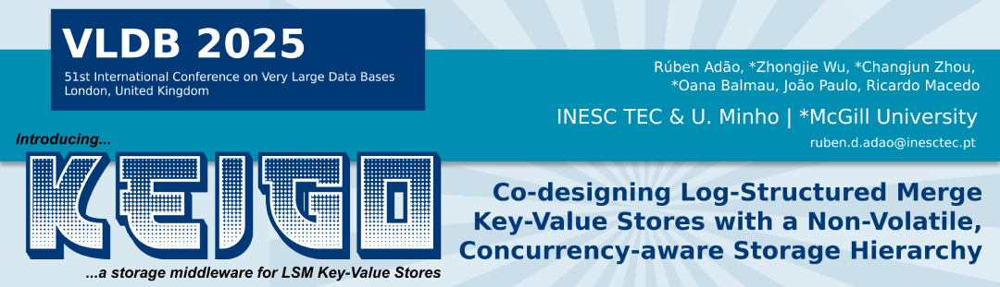

# Keigo: a concurrency- and workload-aware storage middleware for LSM Key-Value Stores

[](LICENSE)
[](https://isocpp.org/)

Keigo is a high-performance, POSIX-compatible wrapper library designed for key-value storage systems with multi-tier storage architectures. Originally designed for LSM-tree based storage engines like RocksDB, Keigo provides intelligent file placement, automated caching, and advanced file lifecycle management across heterogeneous storage tiers including persistent memory (PMEM), SSDs, and traditional HDDs.


Please cite our VLDB 2025 paper if you use Keigo:

```bibtex
@article {Keigo:2025:Adao,
	title 		= {{KEIGO: Co-Designing Log-Structured Merge Key-Value Stores with a Non-Volatile, Concurrency-Aware Storage Hierarchy}},
	author 		= {Ad\~{a}o, R\'{u}ben and Wu, Zhongjie and Zhou, Changjun and Balmau, Oana and Paulo, Jo\~{a}o and Macedo, Ricardo},
	journal	 	= {{Proceedings of the VLDB Endowment}},
	year 		= {2025},
	issue_date 	= {May 2025},
	publisher 	= {VLDB Endowment},
	volume 		= {18},
	number 		= {9},
	pages 		= {2872–2885},
	doi 		= {10.14778/3746405.3746414},
}
```


## Table of Contents

- [Overview](#overview)
- [Key Features](#key-features)
- [Installation](#installation)
- [Configuration](#configuration)
- [Integration Guide](#integration-guide)
- [API Reference](#api-reference)
- [Performance Optimizations](#performance-optimizations)
- [Examples](#examples)
- [RocksDB Integration](#rocksdb-integration)

## Overview

Keigo addresses the challenges of managing data across multiple storage tiers in modern storage systems. By intercepting standard POSIX file operations and routing them through specialized file environments, Keigo enables:

- **Automatic tier placement** based on file type, access patterns, and compaction levels
- **File recycling mechanisms** to reduce allocation overhead for frequently created/deleted files
- **Thread-aware operations** that understand LSM-tree compaction and flush semantics
- **Persistent memory optimizations** for high-performance workloads


## Key Features

### **Performance Optimizations**
- **File Recycling**: Reuses deleted file slots to avoid filesystem allocation overhead
- **Background Tiering**: Asynchronous file migration between storage tiers

### **Intelligent File Placement**
- **Level-Aware Placement**: Automatically places files based on LSM-tree level policies
- **Capacity Management**: LRU-based eviction when storage tiers reach capacity
- **Hot/Cold Data Separation**: Moves cold data to lower-cost storage tiers
- **WAL Optimization**: Special handling for write-ahead log files

### 🔧 **Storage Tier Support**
- **Persistent Memory (PMEM)**: Intel Optane DC Persistent Memory
- **NVMe SSDs**: High-performance solid-state drives
- **SATA SSDs**: Standard solid-state drives
- **HDDs**: Traditional hard disk drives

### 🧵 **Thread and Concurrency**
- **Thread Registration**: Identifies flush and compaction threads
- **Compaction Awareness**: Understands LSM-tree compaction semantics
- **Background Processing**: Non-blocking file migration and management
- **Trivial Move Optimization**: Efficient handling of file-level moves

## Installation

### Prerequisites

```bash
# Ubuntu/Debian
sudo apt-get update
sudo apt-get install -y build-essential cmake git
sudo apt-get install -y libtbb-dev libyaml-cpp-dev

# For PMEM support (optional)
sudo apt-get install -y libpmem-dev libpmemobj-dev
```

### Build from Source

```bash
# Clone the repository
git clone https://github.com/dsrhaslab/keigo.git
cd keigo

# Build using the provided script
./build.sh build-keigo

# Or build manually with CMake
mkdir build && cd build
cmake ..
make -j$(nproc)
sudo make install
```

## Configuration

Keigo uses YAML configuration files to define storage tiers and policies. Configuration files should be placed in the `yaml-config/` directory.

### Basic Configuration

```yaml
# config.yaml
tier1:
  wal: true
  path: /mnt/pmem/kvstore
  engine: pmdk
  policy: 
    type: performance
    levels: [0,1,2,3]
  cache_size: 75161927680  # 70GB
  disk_size: 32212254720   # 30GB

tier2:
  path: /mnt/nvme/kvstore
  engine: posix
  policy: 
    type: capacity
  cache_size: 21474836480  # 20GB
  disk_size: 858993459200  # 800GB

tier3:
  path: /mnt/sata/kvstore
  engine: posix
  policy:
    type: capacity
  disk_size: 2147483648000 # 2TB

configs:
  redirection_map_file: "/tmp/keigo_redirection.map"
  file_extension: ".sst"
  profiler_log: "/var/log/keigo/profiler.log"
  activate_cache: true
```

### Advanced Configuration Options

#### **Tier Policies**

1. **Performance Tier**: Optimized for low latency access
   ```yaml
   policy:
     type: performance
     levels: [0,1,2,3]  # Hot data levels
   ```

2. **Capacity Tier**: Balanced performance and capacity
   ```yaml
   policy:
     type: capacity
     threshold: 21474836480  # LRU eviction threshold
     levels: [4,5,6]
   ```

#### **Engine Types**

- **pmdk**: Intel PMDK for persistent memory
- **posix**: Standard POSIX file operations
- **specialized**: Custom optimized engines


## Integration Guide


#### 1. Initialize Keigo

```cpp
#include "keigo.h"

int main() {
    // Initialize the library
    init_tiering_lib();
    
    // Register the main thread
    registerThread(pthread_self(), THREAD_OTHER);
    
    // Your KVS code here
    
    // Cleanup
    end_tiering_lib();
    return 0;
}
```

#### 2. Thread Registration

```cpp
// In your KVS flush thread
void FlushThread() {
    registerThread(pthread_self(), THREAD_FLUSH);
    // Flush operations...
}

// In your KVS compaction threads
void CompactionThread(int level) {
    registerThread(pthread_self(), static_cast<op_type>(level));
    // Compaction operations...
}
```

#### 3. Replace POSIX Calls

```cpp
// Before: Standard POSIX
int fd = open(filename.c_str(), O_CREAT | O_WRONLY, 0644);
write(fd, data, size);
fsync(fd);
close(fd);

// After: Keigo-enhanced
auto ctx = std::make_shared<Context>(SST_Write, false);
int fd = k_open(filename.c_str(), O_CREAT | O_WRONLY, 0644, ctx);
k_write(fd, data, size);
k_fsync(fd);
k_close(fd);
```

#### 4. Compaction Integration

```cpp
void StartCompaction(int target_level) {
    // Register compaction start
    registerStartCompaction(pthread_self(), target_level);
    
    // Perform compaction
    CompactFiles(input_files, output_level);
    
    // Handle trivial moves if needed
    if (is_trivial_move) {
        enqueueTrivialMove(filename, input_level, target_level);
    }
}
```

### Generic Key-Value Store Integration

For other key-value stores, follow these general steps:

1. **Identify file types**: Determine which files are SST-like and WAL-like
2. **Thread classification**: Identify background threads (flush, compaction)
3. **System call replacement**: Replace file operations with Keigo equivalents
4. **Context creation**: Provide appropriate context for each file operation

## API Reference

### Core Library Functions

#### Initialization

```cpp
void init_tiering_lib();
void end_tiering_lib();
void activate();
bool getRunNow();
```

#### Thread Management

```cpp
void registerThread(pthread_t thread_id, op_type type);
void registerStartCompaction(pthread_t compaction_id, int new_level);
op_type getThreadType(pthread_t thread_id);
```

#### File Operations

```cpp
// File lifecycle
int k_open(const char *pathname, int flags, mode_t mode, 
           std::shared_ptr<Context> ctx);
int k_close(int fd);
int k_unlink(const char *pathname, std::shared_ptr<Context> ctx);

// I/O operations
ssize_t k_read(int fd, void *buf, size_t count);
ssize_t k_write(int fd, const void *buf, size_t count);
ssize_t k_pread(int fd, void *buf, size_t count, off_t offset);
ssize_t k_pwrite(int fd, const void *buf, size_t count, off_t offset);

// Synchronization
int k_fsync(int fd);
int k_fdatasync(int fd);

// Memory mapping
void *k_mmap(void *addr, size_t length, int prot, int flags, 
             int fd, off_t offset);

// File manipulation
int k_ftruncate(int fd, off_t length);
int k_fallocate(int fd, int mode, off_t offset, off_t len);
```

### Context Object

```cpp
class Context {
public:
    FileAccessType type_;  // SST_Read, SST_Write, WAL_Read, WAL_Write
    bool is_pmem_;        // Enable PMEM optimizations
    
    Context(FileAccessType type, bool is_pmem);
};
```

### Advanced Functions

```cpp
// Tier management
void add_sst_level(int sst_file_number, int level);
void enqueueTrivialMove(std::string filename, int input_level, int output_level);

// Path resolution
bool getFileActualPathOpen(std::string fname, std::string &actualPath_ret, 
                          std::shared_ptr<Context>& context);
std::string getFileActualPath(std::string fname);

// Background operations
void* caching_thread(void *ptr);
void stopCacheCondition();
```

## Performance Optimizations

### File Recycling

Keigo implements an advanced file recycling system that significantly reduces filesystem overhead:

```cpp
// Automatic file recycling for frequently created/deleted files
bool recycle_sst_file(std::string pathname, std::string recycled_fname);
bool get_recycled_sst_file(std::string& recycled_fname);
```

**Benefits:**
- Reduces filesystem allocation overhead by ~40%
- Improves write performance for temporary SST files
- Minimizes filesystem fragmentation

### Background Tiering

```cpp
// Background thread for moving files between tiers
void* queue_worker();

// Add file to background migration queue
void add_file_to_trivialmove_queue(copy_info cp_info);
```

**Features:**
- Non-blocking file migration
- Intelligent scheduling based on system load
- Automatic retry on failure

### Persistent Memory Optimizations

When PMEM is available, Keigo automatically:
- Uses memory-mapped I/O for better performance
- Leverages Intel PMDK for optimized operations
- Provides atomic operations for consistency

### Cache Management

```cpp
class DeviceCache {
    void add_non_cached_files_access_counter(int sst_number, Node_c* node);
    void remove_non_cached_files_access_counter(int sst_number);
    bool shouldCache(int sst_number);
};
```

## Examples

### Basic Usage

```cpp
#include "keigo.h"

int main() {
    // Initialize
    init_tiering_lib();
    
    // Create context for SST file writing
    auto ctx = std::make_shared<Context>(SST_Write, true);
    
    // Open file (automatically placed in optimal tier)
    int fd = k_open("/data/table.sst", O_CREAT | O_WRONLY, 0644, ctx);
    
    // Write data
    char data[4096] = "sample data";
    k_write(fd, data, sizeof(data));
    
    // Sync and close
    k_fsync(fd);
    k_close(fd);
    
    // Cleanup
    end_tiering_lib();
    return 0;
}
```

## RocksDB Integration

We provide a version of RocksDB that is already integrated with Keigo as a submodule (`tiered-rocksdb`).

### Building RocksDB with Keigo

```bash
# Clone keigo with all submodules
git clone --recurse-submodules https://github.com/dsrhaslab/keigo.git
cd keigo

# Build RocksDB
./build.sh build-rocksdb
```

The RocksDB build will be available in `tiered-rocksdb/build/`.

